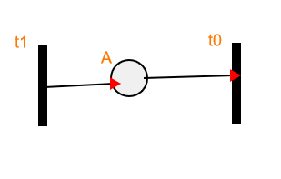
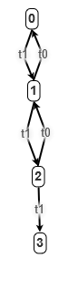

---
Title - Petri net model and visualization  
Author - Ütő Bence  
Date - 2020.09.14.
---

Used libraries: 
 - jQuery - https://ajax.googleapis.com/ajax/libs/jquery/3.5.1/jquery.min.js
 - CreateJS - https://code.createjs.com/1.0.0/easeljs.min.js
 - GoJS - https://unpkg.com/gojs/release/go.js

---

**jQuery** has two main reasons to be used here. First: GoJs is dependent on it. Second: It just makes life easier.
Instead of the long lines of \
`document.addEventListener('DOMContentLoaded', (event) => {})` 

you can simply put \
`$(document).ready(function() {  });` 

The whole event handler system is just easier to use, then native javascript's.
Let's see some example:
<pre>
$("#manual_title").on('click', function () { 
    $("#manual").slideToggle();
});
</pre>
This is the code responsible for make the manual toggleable. In vanilla JS this would look like:
<pre>
let manual = document.getElementById("manual_title");
let manual_title = document.getElementById("manual_title");

manual.addEventListener("click", function(){    
    if (manual_title.style.display === "none") {
        manual_title.style.display = "block";
    } else {
        manual_title.style.display = "none";
    }
});
</pre>
...and it wouldn't even be animated. 

jQuery documentation can be found at: [https://api.jquery.com/](https://api.jquery.com/)

---

**CreateJS** is something else. It's not just speed up coding, but giving functionalities
which I might struggle to implement myself. CreateJS is responsible to interact with canvas. \
But how it is working?
 1. Create one (or more) stage(s) that will contain one or more of your graphics
 1. Add some graphics, that later you want to show and interact with.
 1. Add graphics to the stage
 1. Update stage to show changes
 
Making the graphics of the PetriObjects are done in the *make* function of the instance.
For example a transition can be drawn like this:
<pre>
let transition = new createjs.Shape();
transition.graphics.beginFill('black').drawRect(this._x, this._y, this._h, this._w);
stage.addChild(transition);
</pre>
The functions of CreateJS are pretty self-explanatory. `drawRect` means, it will draw
a rectangle. The top left corner is in `x,y` and it has the width and height of `w,h`.
Drawing the connections are very similar.
<pre>
let connection = new createjs.Shape();
connection.graphics.setStrokeStyle(2)
    .beginStroke('black')
    .moveTo(firstPoint.l_x, firstPoint.l_y)
    .lineTo(evt.stageX, evt.stageY)
    .endStroke()
    .beginFill("red")
    .drawPolyStar(evt.stageX, evt.stageY, 8, 3)
    .endFill();
stage.addChild(connection);
</pre>
As you can see here, the connections are fixed drawings, they cannot be moved easily. 
That's why the objects cannot be moved after being used. 

 - `firstPoint` contains the object first clicked. `l_x` and `l_y` are the exact clicking positions.
 - `evt.stageX` and `evt.stageY` are normalized coordinates of the clicking. Normalized
means the range is between 0, and the height of canvas.
 - `stage` again is a global variable containing the one and only stage, that is presented to the user.

CreateJS (EaselJS) documentation can be found at: [https://createjs.com/docs/easeljs/modules/EaselJS.html](https://createjs.com/docs/easeljs/modules/EaselJS.html)
CreateJS contains 4 sublibs: 
 - EaselJS - HTML5 canvas
 - TweenJS - HTML5 animations
 - SoundJS - Web audio
 - PreloadJS - Data and asset loading 
 
Out of this 4, only EaselJS is used in this project, but all 4 are included.

---

**GoJS** is again something different. I haven't used this lib before, but the API documentation
is well-developed, and it provides a handful of sample codes. In the project I've just used the 
so called 'basic' sample. I've deleted a lot of it, to be as simply as possible. I've only
added one feature from another sample, so the arrows contain the transition's name.

The GoJS lib is used for two function calls. `visualize_init` and `do_visualize`.
The first one is responsible for the initialization of the environment for the later graph
printing. The way I have used it:
 1. Call initializer
    - Selecting the corresponding `div` for drawing
    - Setting the `nodeTemplate`
        - Location
        - Shape
        - Text (which contains the state on the node)
    - Setting `linkTemplate`
        - Shape (arrowhead, so it has multiple shapes)
        - TextPanel (which contains the transition name on the arrow)
 1. Call do_visualise every time after 'Run' button is pressed
    - `nodeDataArray` - containing the actual node's (states)
    - `linkDataArray` - containing the transitions between nodes

### Example:

    

<pre>
nodeDataArray = [
    {
        "key": 1,
        "text": "0"
    },
    {
        "key": 2,
        "text": "1"
    },
    {
        "key": 3,
        "text": "2"
    },
    {
        "key": 4,
        "text": "3"
    }
];
</pre>
<pre>
linkDataArray = [
    {
        "from": 1,
        "to": 2,
        "text": "t0"
    },
    {
        "from": 2,
        "to": 3,
        "text": "t0"
    },
    {
        "from": 3,
        "to": 4,
        "text": "t0"
    },
    {
        "from": 3,
        "to": 2,
        "text": "t1"
    },
    {
        "from": 2,
        "to": 1,
        "text": "t1"
    }
];
</pre>

Every object contains a `__gohashid` as well, but these are not relevant for us, only the 
lib uses them.

---

TODOs:
 1. ~~Make failsafe~~
 1. ~~Check limits (like: no connections, single place or transitions)~~
 1. ~~Clear and reinitialize button~~ -- Solved by proper cleanup in the end and at run
 1. ~~Add manual~~ 
 1. ~~Consider making and object movable multiple times~~ -- Until it is connected or token is placed on it
 1. Place an object need a click and a drag, make it only one 
 1. Raise exception everywhere it is needed and catch them more responsively

